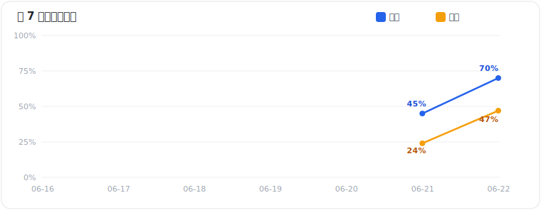

<div align="center">

# ⚽ WorldCup-Analysis-Skill

**给你的 AI 装上"资深足球分析师的大脑"——用因果推理 + 实时联网,做可解释的世界杯赛事预测**

不再是"问大模型谁会赢",而是一条有定量锚、有因果推理、有实时数据、会自我校准的完整分析流水线。

    

[简介](#-简介) · [实战战报](#-实战战报) · [为什么](#-为什么需要它) · [核心特性](#-核心特性) · [工作原理](#️-工作原理) · [目录结构](#-目录结构) · [安装](#-安装) · [使用](#-使用方法) · [输出示例](#-输出示例) · [设计原则](#-设计原则) · [记忆系统](#️-记忆与自反思) · [信源](#-数据信源) · [FAQ](#-faq) · [免责声明](#️-免责声明)

</div>

---

## 📖 简介

**WorldCup-Analysis-Skill** 是一个 Agent Skill(SKILL.md + 模块化文档),把单场足球比赛的"分析 + 预测"做成一条可解释的流水线。输入一句话(如"分析预测 6/21 突尼斯 vs 日本"),它会联网拉取实时数据、做多步因果推理,输出一整套预测——**胜平负 / 让球 / 比分 / 大小球 / 半全场**——且每一项都附带"子分析",讲清楚为什么。

它的内核是一条**贝叶斯脊柱**:

> **定量先验 → 有界、带机制的调整 → 校准后验**

统计给出不会漂移的基准,实时证据**只通过显式机制**去更新它,结果天然可解释。

## 📈 实战战报



> **分项** = 每个玩法命中一档即算中(分母=分项数)　**逐档** = 每个预测档单独算(分母=所有预测档数)。下表只给命中项打 ✅,留白即未中。

### 🏷️ v1.1 · 2026-06-22(I/J 组 4 场)

| 比赛 | 真实结果 | 胜平负 | 让球 | 比分 | 大小球 | 半全场 |
|---|---|---|---|---|---|---|
| 法国 vs 伊拉克 | **3-0** | 法国胜 ✅ | 让2 胜 ✅ | 3-0 ✅ / 4-0 | 3球 ✅ / 4球 | 胜胜 ✅ |
| 阿根廷 vs 奥地利 | **2-0** | 阿根廷胜 ✅ | 让1 胜 ✅ | 2-0 ✅ / 3-0 | 3球 / 2球 ✅ | 胜胜 ✅ |
| 挪威 vs 塞内加尔 | **3-2** | 挪威胜 ✅ / 平 | 塞内受让胜 | 2-1 / 1-1 / 2-0 | 3球 / 2球 | 平胜 |
| 阿尔及利亚 vs 约旦 | **2-1** | 阿尔及利亚胜 ✅ | 阿让1 胜 | 2-0 / 2-1 ✅ | 2球 / 3球 ✅ | 平负 |

**命中率｜分项 14/20 = 70%　·　逐档 14/30 ≈ 47%**

### 🏷️ v1.0 · 2026-06-21(G/H 组 4 场)

| 比赛 | 真实结果 | 胜平负 | 让球 | 比分 | 大小球 | 半全场 |
|---|---|---|---|---|---|---|
| 西班牙 vs 沙特 | **4-0** | 西班牙胜 ✅ | 受让沙特 | 2-0 / 1-0 / 3-0 | 小球 / 2-3球 | 胜胜 ✅ / 平胜 |
| 比利时 vs 伊朗 | **0-0** | 比利时胜 / 不败 ✅ | 受让伊朗 ✅ | 1-0 / 2-1 / 2-0 | 小球 ✅ / 2-3球 | 平胜 / 胜胜 / 平平 ✅ |
| 乌拉圭 vs 佛得角 | **2-2** | 乌拉圭胜 / 不败 ✅ | 受让佛得角 ✅ | 1-0 / 2-0 / 2-1 | 小球 / 1-2球 | 平胜 / 胜胜 / 平平 |
| 埃及 vs 新西兰 | **3-1** | 埃及胜 ✅ / 不败 ✅ | 受让新西兰 | 1-0 / 1-1 / 2-0 | 小球 / 2-3球 | 平负 / 负负 / 平平 |

**命中率｜分项 9/20 = 45%　·　逐档 10/42 ≈ 24%**

## 🎯 为什么需要它

资深球迷做赛事分析时反复撞到的几堵墙:

| 痛点 | 这个 Skill 怎么解 |
|---|---|
| 1️⃣ 国家队历史数据少,球员日常数据散落在各自联赛,没有平台能完整聚合 | **多路召回**:从大名单按身价锁定关键球员 → 拉他们各自联赛的近赛季数据 → 联赛强度归一化后聚合成"天赋天花板" |
| 2️⃣ 很多博主的分析思路要付费才能看 | 把博主那套加工(尤其赛前信息挖掘)**自动化、可解释化**,自己产出 |
| 3️⃣ 赛前新闻(阵容、状态、伤病)信息量大但难挖 | 专门的**赛前新闻 NLP 通道**,把非结构化新闻抽成结构化信号 |
| 4️⃣ 训一个模型本质是"共现预测"而非"因果推理" | 不训模型——用大模型的**因果机制先验 + 实时联网 + 多步推理**,并把因果推理**工程化**进流水线 |

> ⚠️ **关于"因果"的一个清醒认识**:大模型并不天然做因果推理,它只是有一套从海量比赛报道里学到的"足球因果机制强先验";它能为任何结果即兴编一条合理的因果链(叙事偏差,本质是另一种共现)。所以这个 Skill 把因果能力**工程化**——强制机制链、强制反事实、强制论证反面——而不是指望"换成大模型"白送。

## ✨ 核心特性

- 🔍 **多路召回(八路:A–G 并行 + H 记忆复盘)** —— 评级 / 身价名单 / 球员联赛数据 / 近况交手 / 战术对位 / 赛前新闻 / 盘口 / 记忆,像搜广推的多路召回
- 🧠 **因果推理层** —— 机制链、对位交互、反事实、国家队默契折扣;判断的是"信号通过什么机制改变结果",不是相关性
- 📊 **贝叶斯校准** —— 双变量泊松比分矩阵,五项玩法**全部从同一个后验读出**,内部自洽
- 📰 **赛前新闻挖掘** —— 阵容/伤病/停赛/动机的结构化抽取,"已确认"与"预计"严格分开
- 💹 **盘口锚定** —— 把市场隐含概率当最强基线和谦虚标尺;让球线/大小球线**先联网查到再预测,绝不编**
- 🧾 **全程可解释** —— 每个预测都带子分析;置信度越高,给的预测个数越少
- 🗃️ **记忆与自反思** —— 历史预测会在下次被**自动结算**(补真实结果+反思),并反哺本次判断
- 🎯 **校准闭环** —— Brier / log-loss 打分,整届下来告诉你哪条召回路加价值、哪条是噪声

## ⚙️ 工作原理

一条搜广推式漏斗。每一步都对应 `references/` 里的一份文档:

```
用户提问:"分析预测 X vs Y"
        │
        ▼
 ① 界定 Scope ─────── 确定比赛 / 开赛时间 / 当前可知信息量 / 涉及哪些玩法
        │
        ▼
 ② 记忆 Memory ────── 查历史记录 → 对已打完的旧预测"懒结算" → 反思入场(Channel H)
        │
        ▼
 ③ 召回 Recall ────── 七路并行,各吐"定型证据"(只给证据,不给概率)
        │
        ▼
 ④ 粗排 Coarse-rank ─ 去重 / 去时效 / 信源分级 / 杀重复计价
        │
        ▼
 ⑤ 精排 Fine-reason ─ 机制链 / 对位 / 反事实 / 默契折扣  ← 因果层
        │
        ▼
 ⑥ 重排 Synthesize ── 定量先验 + 比分矩阵 → 有界调整 → 反过度自信 → 一个后验
        │
        ▼
 ⑦ 输出 Output ────── 三段式中文报告(每项预测带子分析)
        │
        ▼
 ⑧ 校准 + 写回 ────── Brier/log-loss 打分 + 本次预测写回 memory/(待下次自动结算)
```

**八路召回通道:**

| 通道 | 名称 | 抓什么 |
|---|---|---|
| A | 评级 | 国家队 Elo / Opta 超算概率 / 实力差 |
| B | 身价名单 | 大名单按身价取关键球员(含门将,floor=前 11,放宽到 14–16) |
| C | 球员联赛数据 | 关键球员各自联赛近赛季数据 → 归一化聚合成天赋天花板 |
| D | 近况 / 交手 / 赛程 | 近 5–6 场(带底层 xG)/ H2H / 轮休旅途 / 小组出线情景 |
| E | 战术 / 默契 | 风格对位 + 默契折扣(11 个强个体 ≠ 强球队) |
| F | 赛前新闻 | 阵容 / 伤病 / 停赛 / 动机(NLP 抽取,确认 vs 预计分开) |
| G | 盘口 | 1X2 隐含概率 + 让球线 + 大小球线 + 盘口移动 |
| H | 记忆 / 自反思 | 历史对这两队/这对阵的实际表现复盘(只给校准修正,不重塞旧比分) |

## 📁 目录结构

```
WorldCup-Analysis-Skill/
├── SKILL.md                          # 编排层:哲学 + 流水线 + I/O 契约 + 纪律
├── README.md                         # 本文件
├── references/                       # 协议层(按需加载的 how-to)
│   ├── recall-channels.md            #   八路召回:每路抓什么、吐什么
│   ├── evidence-schema.md            #   定型证据记录格式(证据进、概率出)
│   ├── reasoning-and-synthesis.md    #   比分矩阵 + 五项玩法推导 + 反过度自信
│   ├── output-format.md              #   三段式中文输出模板 + 示例
│   ├── sources.md                    #   2026 当前信源分级
│   ├── calibration-log.md            #   Brier/log-loss 打分方法论
│   └── memory-protocol.md            #   记忆库:schema / 生命周期 / 反哺规则
└── memory/                           # 数据层(持久化记录,与 references 并列)
    ├── index.md                      #   索引表(先扫这个)
    └── records/
        └── _TEMPLATE.md              #   单场记录模板
```

> 渐进加载:`SKILL.md` 是常驻总纲;`references/` 里的细节只在用到那一步时才读;`memory/` 是会随使用增长的数据。

## 🚀 安装

**方式一 · 文件夹/打包(最简单)**
把整个 `WorldCup-Analysis-Skill/` 文件夹放进你的 skills 目录,或直接安装打包好的 `WorldCup-Analysis-Skill.skill`。

**方式二 · 直接引用 SKILL.md**
在对话里让 agent 读取并遵循 `SKILL.md`(如在 Cursor 里 `@SKILL.md`),把任意 `*.md` 粘进 ChatGPT / Codex 也行。

**方式三 · 发布到 GitHub 后(参考 taste-skill 的安装方式)**
```bash
npx skills add https://github.com/SuFame920/WorldCup-Analysis-Skill
```

## 💬 使用方法

直接用自然语言提问即可,Skill 会自动触发:

```
请分析和预测 2026 世界杯 6/21 突尼斯 vs 日本这场
日本 vs 瑞典这场怎么看?
帮我看下这场让球和大小球
```

触发词:`分析` / `预测` / `世界杯` / `让球` / `亚盘` / `大小球` / `比分` / `半全场` / `谁会赢` / 直接给两支球队 + 日期。

## 📋 输出示例

输出固定为三段式(中文):

```
一、整体方向分析
   总体研判 + 为什么(显式点出关键信息源:评级/近况/伤病阵容/盘口/对位…)

二、分项预测(每项附"子分析",且必须可解释)
   · 胜平负(1–2 个)
   · 让球胜负(1–2 个;让球线先联网查到)
   · 比分(2–3 个;越有把握个数越少)
   · 大小球(2 个;大小球线先联网查到)
   · 半全场(1–2 个;[半场][全场] 主队视角胜平负,9 种;方差最大,通常 1 个)

三、预测总结
   一眼看完的结论清单
```

**置信度→个数是硬规则**:某类玩法的预测分布越尖,给的个数越少(如比分头部明显领先就给 2 个,挤在一起才给 3 个)。

> 完整示例(基于真实赛前背景的突尼斯 vs 日本)见 [`references/output-format.md`](references/output-format.md)。

## 🧭 设计原则

- **贝叶斯脊柱** —— 定量先验不丢,叙事只能在上限内微调它
- **证据进、概率出** —— 各召回通道只吐定型证据,唯一一个合成步骤吐概率(否则无法校准、会重复计价)
- **防双重计价** —— 已被评级/盘口吸收的信息不再当新证据加一遍(记忆库尤其遵守这条)
- **反过度自信** —— 尊重世界杯单场方差:强队也压在 ~65%、势均力敌留 24–30% 平局
- **论证反面** —— 锁定倾向前先讲对面最强理由;对面很强就把分布摊平
- **校准闭环** —— 记概率、对真实结果打分;样本太少学不了权重,日志就是唯一的反馈信号

## 🗃️ 记忆与自反思

`memory/` 把每次预测变成一条**会自我结算、可检索、能反哺**的记录:

1. **查** —— 新预测前先扫 `index.md`,按球队或按整对阵找历史记录
2. **懒结算** —— 命中的旧预测若已打完,就联网补真实结果、做反思(打分 + 归因到具体通道),无需后台任务
3. **反哺** —— 作为 Channel H 入场,**只给校准修正/对阵先验,不重塞旧比分**(防双重计价)
4. **写回** —— 本次预测写成新的 `pending` 记录,等下次自己结算

> 例:`memory/` 里有"日本-荷兰",下次淘汰赛又有日本的球 → 这条记录作反思+参考;若下次又是"日本-荷兰" → 直接对阵复现,价值更大。检索用规范英文小写+字母序做 join key(`japan_vs_netherlands`),避免 日本/Japan/Nippon 对不上。

## 🔗 数据信源

按可靠度分级,**实时联网取数**(详见 [`references/sources.md`](references/sources.md)):

- **评级**:World Football Elo(eloratings.net,专为国家队)、Opta/The Analyst 超算
- **身价/伤病**:Transfermarkt
- **球员数据(xG)**:Understat、StatsBomb 开放数据、Sofascore / WhoScored / FotMob
- **盘口**:实时赔率聚合 / 博彩公司(让球线、大小球线、盘口移动)

> ⚠️ **2026 已知坑(已写进 Skill)**:FBref 于 2026 年 1 月失去 Opta 授权 → 只剩历史数据,别拿它当当前赛季高级数据源。这正说明为什么需要多路召回——没有单一信源能覆盖全部。

## ❓ FAQ

**Q:它能保证预测准吗?**
A:不能。足球单场方差极大,这是一个**结构化的概率研判**,不是水晶球。它的价值在校准和可解释,以及用记忆库长期复盘自我修正。

**Q:为什么不直接训一个模型?**
A:国家队样本太少,训出来基本是共现拟合。大模型的因果机制先验 + 实时新闻 + 多步推理在这种低样本场景更合适——前提是把因果推理工程化进流水线(本 Skill 做的就是这件事)。

**Q:让球/大小球的盘口线哪来的?**
A:运行时由盘口通道**联网实时查**。查不到就定性判断并注明"线未确认",绝不编一个数。

**Q:半全场怎么表示?**
A:`[半场结果][全场结果]` 的组合、主队(列前队)视角、各取胜/平/负,共 9 种(胜胜/胜平/胜负/平胜/平平/平负/负胜/负平/负负),其中负胜(逆转)/胜负(被翻盘)概率最低。

**Q:记忆会不会越用越偏?**
A:有小样本纪律——一两条记录不算证明偏差,反思只作弱先验、随记录累积才加权;被方差打败的正确流程不算模型错误。

## ⚠️ 免责声明

本 Skill 的输出是**分析性的概率估计,不是保证,也不是投注建议**。足球本身逐场不可预测;请把这些数字当作对赔率的一种结构化解读,用记忆库诚实记录每一次命中与失手,让日志(而非记忆)告诉你你的调整到底加的是信号还是噪声。理性看球,量力而行。

## ⭐ Star History

[](https://star-history.com/#SuFame920/WorldCup-Analysis-Skill&Date)

## 📄 License & 致谢

许可证由作者自定(建议 MIT)。布局参考了 GitHub 上 [taste-skill](https://github.com/Leonxlnx/taste-skill) 等开源 skill 的组织方式。欢迎 issue / PR 与反馈。

<div align="center">

**⚽ 愿你的每一次预测,都比上一次更校准。**

</div>
